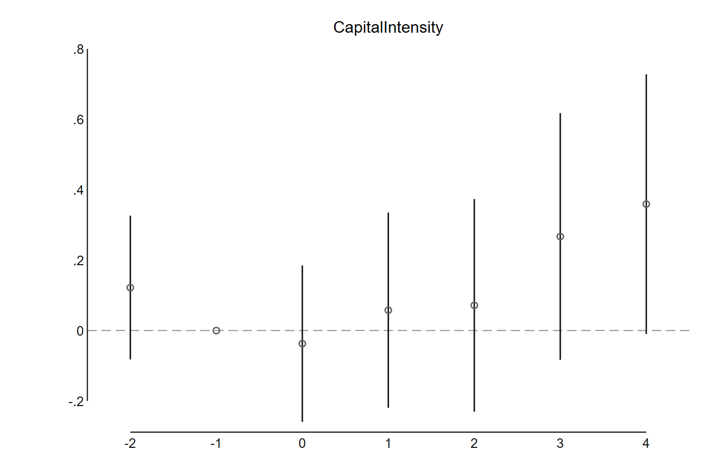
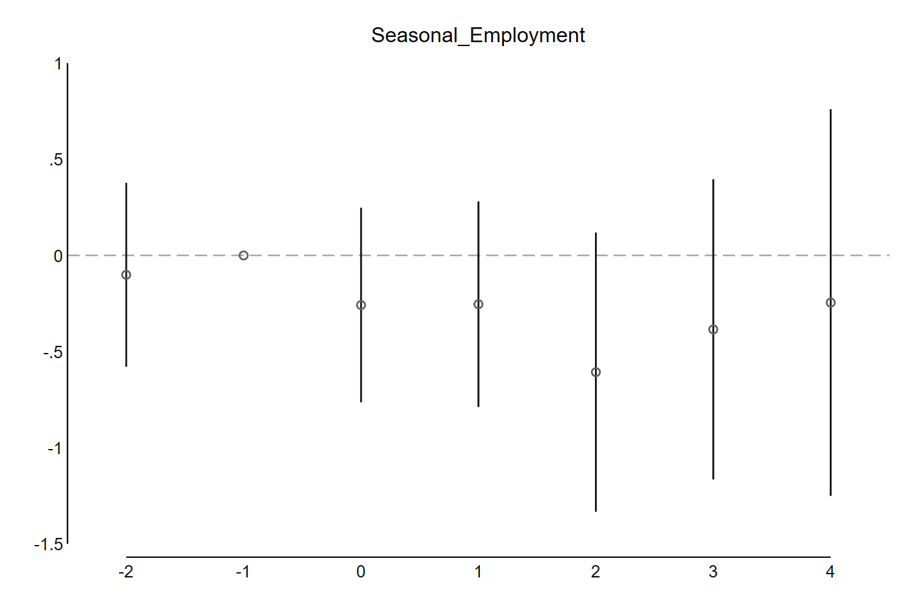
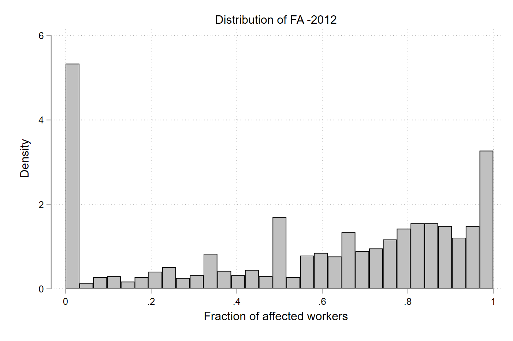
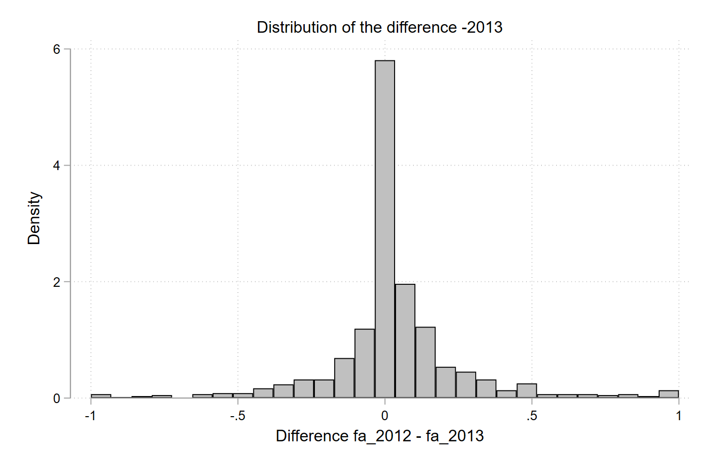

```{r, load_refs, eval = T, include=FALSE, cache=T}
library(RefManageR)
BibOptions(check.entries = FALSE,
           bib.style = "authoryear",
           cite.style = "authoryear",
           style = "markdown",
           hyperlink = "to.doc",
           dashed = T)
## Delete cache if you add an entry to seiro.bib.
myBib <- ReadBib("c:/seiro/settings/TeX/seiro.bib")
```
```{r xaringan-themer, include=FALSE, warning=FALSE}
library(xaringanthemer)
style_mono_light(
  base_color = "#23395b"
  #, text_color = "white"
  #, title_slide_background_color = "darkblue"
  , link_color = "lightgreen"
)
xaringancolor::setup_colors(
  red ="red",
  green = "green",
  orange = "orange",
  blue = "blue"
)
```
<style>
.red {color: #FF0000;}
.green {color: #00FF00;}
.blue {color: #0000FF;}
</style>
```{r flair_color, echo=FALSE}
library(flair)
red <- "#FF0000"
green <- "#00FF00"
blue <- "#0000FF"
```
```{css, echo = F}
.pull-left {
  padding-right: 2px
  margin-top: -1em;
  margin-bottom: 0em;
}
.pull-right {
  padding-left: 2px
  margin-top: -1em;
  margin-bottom: 0em;
}
```
<script type="text/x-mathjax-config">
MathJax.Hub.Config({
  TeX: {
    Macros: {
      E: "{\\Large\\varepsilon}",
      bfx: "{\\mathbf{x}}",
      bfX: "{\\mathbf{X}}",
      bfalpha: "{\\boldsymbol{\\alpha}}",
      bfbeta: "{\\boldsymbol{\\beta}}",
      bfgamma: "{\\boldsymbol{\\gamma}}",
      st: "{\\mbox{s.t.}}"
    }
  }
});
</script>

## Main sample: Firm-worker (CIT-IRP5)

### Base

All ag farms & observed from 2010 or 2011 & dropping years other than 2010-2016 & dropping farm-year observations with missing value in key sales and cost variables (value_added, g_cos, g_sales, irp5_kerr_weight_b, x_labcost).

### Survivor

Base & dropping farms with a missing observation for some year.

### Unbalanced portion

Base - Survivor.

### Balanced

Base sample with NA={0, interporated within-farm mean}. 

---
## Main sample: Firm-worker (CIT-IRP5)

### Low wage worker subsample

Any of above & workers earning $<$ R5400 per month for all periods 

### High wage worker subsample

Any of above - Low wage worker subsample  

--

### Seasonal worker subsample

Any of above & workers working less than 6 months 

### Non-seasonal worker subsample

Any of above - seasonal worker subsample  

--

For any sample in {Base/Balanced/Survivor/Unbalanced portion}  

Low wage worker subsample + high wage worker subsample = sample

---
class: inverse

## Computing employment elasticity

Our current estimate $\beta_{t}$ measures impacts of sub-MW worker % on % change of $y_{it}$:

\begin{equation*}
\% \mbox{ change in }y_{it} = \alpha_{t}+\beta_{t}FA_{i}+\bfgamma'\bfx_{it}+\epsilon_{it}.
\end{equation*}

--

### If $FA_{i}=1$, all workers are sub-MW workers, and $\beta_{t}$ measures the impacts of (% change in) MW.
<p style="margin-bottom:.75cm;">

--

### If $FA_{i}=.5$, 1/2 of workers are sub-MW workers, and $\beta_{t}$ measures the impacts of (% change in) MW applied on 1/2 of workers. To get back the "full" impact (= impact when $FA_{i}=1$), $\frac{\beta_{t}}{.5}$.
<p style="margin-bottom:.75cm;">

--

### $\frac{\hat{\beta}_{t}}{FA_{i}}$ gives an elasticity of MW on outcome $y_{it}$. 

--

* This .red[assumes MW impacts on sub-MW workers do not spill over to above-MW workers.] <!--(similar but different from SUTVA, because the treatment is at the farm level and above-MW workers are in the same treatment unit while SUTVA asks if impacts spill over to other treatment units)-->

---
class: inverse, center, middle

# From Michael, Feb 13, 2024

---
class: inverse

## Capital intensity rose. Capital increased, most among Survivors.
<p style="margin-bottom:1cm;">

--

## High wage and non-seasonal workers took a cut in wage at the impact. 
<p style="margin-bottom:1cm;">

--
## High wage employment decreased at the impact. 
<p style="margin-bottom:1cm;">

--

## Low wage and non-seasonal employment reduced after 3-4 years. Seasonal employment did not change.  
<p style="margin-bottom:1cm;">


--

## Better focus on seasonal/non-seasonal dimension.  

---
class: inverse, middle

## Survivor and other samples show different patterns but only mildly. 
<p style="margin-bottom:1cm;">

--

## Unbalanced portion did not adjust as much as other samples.

---
class: inverse, middle, center

## Sub-R5400 farms vs. full sample

---
class: split-five, inverse

.column.bg-indigo[.content[
<center>
<p>
Survivor  <br>
Sub-R5400
</p>
</center>


]]
.column.bg-indigo[.content[
<center>
<p>
Survivor  <br>
Full sample
</p>
</center>


]]
.column.bg-indigo[.content[
<center>
<p>
Balanced  <br>
Sub-R5400
</p>
</center>


]]
.column.bg-indigo[.content[
<center>
<p>
Balanced  <br>
Full sample
</p>
</center>


]]
.column.bg-inverse[.content[

* Capital intensity  
* Employment  
* Capital

]]
---
class: split-five, inverse

.column.bg-indigo[.content[
<center>
<p>
  <br>

</p>
</center>
]]
.column.bg-indigo[.content[
<center>
<p>
Unbalanced portion  <br>
Sub-R5400
</p>
</center>




]]
.column.bg-indigo[.content[
<center>
<p>
Unbalanced portion  <br>
Full sample
</p>
</center>


]]
.column.bg-indigo[.content[
<center>
<p>
  <br>

</p>
</center>
]]

.column.bg-inverse[.content[
]]
---
class: split-five, inverse

.column.bg-indigo[.content[
<center>
<p>
Survivor R5400
</p>
</center>


]]
.column.bg-indigo[.content[
<center>
<p>
Survivor full
</p>
</center>


]]
.column.bg-indigo[.content[
<center>
<p>
Balanced R5400
</p>
</center>


]]
.column.bg-indigo[.content[
<center>
<p>
Balanced full
</p>
</center>


]]
.column.bg-inverse[.content[

.orange[R5400 and full samples look the same.  ]

* High wage worker wages  
* Non-seasonal wages  
* Low wage worker wages  
* Seasonal wages

]]
---
class: split-five, inverse

.column.bg-indigo[.content[
<center>
]]
.column.bg-indigo[.content[
<center>
<p>
Unbalanced R5400
</p>
</center>


]]
.column.bg-indigo[.content[
<center>
<p>
Unbalanced full
</p>
</center>


]]

.column.bg-inverse[.content[
]]
.column.bg-inverse[.content[
]]
---
class: split-five, inverse

.column.bg-indigo[.content[
<center>
<p>
Survivor R5400
</p>
</center>


]]
.column.bg-indigo[.content[
<center>
<p>
Survivor full
</p>
</center>


]]
.column.bg-indigo[.content[
<center>
<p>
Balanced R5400
</p>
</center>


]]
.column.bg-indigo[.content[
<center>
<p>
Balanced full
</p>
</center>


]]
.column.bg-indigo[.content[
* High wage employment  
* Non-seasonal employment  
* Low wage employment  
* Seasonal employment

]]
---
class: split-five, inverse

.column.bg-indigo[.content[
]]
.column.bg-indigo[.content[
<center>
<p>
Unbalanced R5400
</p>
</center>



]]
.column.bg-indigo[.content[
<center>
<p>
Unbalanced full
</p>
</center>


]]
.column.bg-indigo[.content[
]]
.column.bg-indigo[.content[
]]
---
class: inverse, middle, center

# From Michael, 2024 Feb 13, histograms 

---
class: split-five, inverse

.column.bg-indigo[.content[
<center>
Survivors
</center>


]]
.column.bg-indigo[.content[
<center>
Balanced
</center>


]]

.column.bg-indigo[.content[
<center>
Unbalanced portion
</center>





]]
.column.bg-inverse[.content[
.orange[
Survivors and Balanced show similar dist in all years.  

Unbalanced have smaller FAs in 2012.  

In 2017, nonzero FAs are almost uniform.
]
]]
.column.bg-inverse[.content[
]]
---
class: inverse, middle, center

# Summary of discussions, 2024 Feb 13 

---
class: inverse

# Main story

### Less than full adj of wages. "Partial" compliance.  
### Gradual reduction, non-seasonal and low wage employment.  
### No changes in seasonal employment.  
### Capital intensification.  
<p style="margin-bottom:1.25cm;">

## Employment reduction despite smaller effective shocks $\leftarrow$ "partial" compliance 
<p style="margin-bottom:.75cm;">
## Farms gradually adjust in conjunction with partial compliance and capital increase (in anticipation of further MW&uarr;, or process just takes time?)  

---
class: inverse

# Sample contrasts

## Survivor vs Unbalanced portion: Productive vs. Less productive farms

* Capital intensification: With or without capital increase  
* Low wage worker wages: Less or more pronounced drop 

## Survivor vs Balanced: Counting farm deaths

* Negative outcomes may get more pronounced?
<p style="margin-bottom:1.25cm;">

--

# Weights

* Use pre-policy values (employment, etc.) for all periods.  
* Using concurrent values may over- or under-state the impacts.  

---
class: inverse

# Tone: Our impact estimates are conservative.

## "Partial" compliance

## Survivor sample

## Still, we see substitution away from labour (except seasonal) to capital after 4-5 years. 
<p style="margin-bottom:1.5cm;">

---
class: inverse

# Tone on interpretation: Partial compliance or compliance (reliance on part time workers, or "legal incompliance"?).
<p style="margin-bottom:1.5cm;">

--

## We cannot tell which. 
<p style="margin-bottom:.5cm;">

--

## But it does not matter. 
<p style="margin-bottom:.5cm;">

--

## Farms did not pay full MW even 4 years after introduction. This is the base of what we measure. Ne need to argue if it is due to incompliance.  

---
class: inverse

## Bhorat et al. (2014) discuss the reasons of possible muted wage impacts and employment adjustments.  

`r Citet(myBib, "BhoratKanburStanwix2014")` on 2003 intro of MW

--

* Possibility of reallocation of non monetary benefits to wages (start deducting rents, etc.) Write as (p.1406):  
> _the biggest challenge for analyzing the wage gains in the sector._ 

--

* Casual observations of: Permanent workers &rarr; contract or seasonal workers.  

<!--


Their wage impacts (22%), hours worked (5 hrs) impacts are positive.  

* They wrote a section "Assessing employment losses...". Someone (authors or editor) was not happy with positive employment impacts?  
* No estimation of full time employment impacts (could see disemployment if casual observation was correct).  


Their treatment variable is either:  
1. Farm vs. nonfarm workers with similar qualifications: A common trend between individuals?  
1. Wage gap (MW-median ag worker wage) of the district: A common trend between districts? Similar to FA.  

-->

---
class: inverse
```{r results = "asis", warning = F, echo = F}
PrintBibliography(myBib, .opts = list(check.entries = F, sorting = "nyt",
  no.print.fields=c("eprint", "URL")),
  start = 1, end = 8)
```

