```{r, load_refs, eval = F, include=FALSE, cache=FALSE}
library(RefManageR)
BibOptions(check.entries = FALSE,
           bib.style = "authoryear",
           cite.style = "alphabetic",
           style = "markdown",
           hyperlink = FALSE,
           dashed = FALSE)
myBib <- ReadBib("./seiro.bib", check = FALSE)
```
```{r xaringan-themer, include=FALSE, warning=FALSE}
library(xaringanthemer)
style_mono_light(base_color = "#23395b")
```
```{css, echo = F}
.pull-left {
  padding-right: 2px
  margin-top: -1em;
  margin-bottom: 0em;
}
.pull-right {
  padding-left: 2px
  margin-top: -1em;
  margin-bottom: 0em;
}
```

## Michael firm samples (CIT-IRP5)

### Base

All ag farms & observed from 2010 or 2011 & dropping years other than 2010-2016.

### Unbalanced

All base farms, dropping farm-year observations with missing value in key sales and cost variables (value_added, g_cos, g_sales, irp5_kerr_weight_b, x_labcost).

### Balanced

Unbalanced panel & missing values in other variables (ltrain, lnon_wage_labcosts, lawage, llabcost_pe, loprofit, lmaterials, l_labcost, loprofits_pe, lrevenue, lrev_pe) were replaced with value = 0.

### Survivor

Unbalanced panel & dropping farms with a missing observation for some year.

--

### Survivor $\subset$ Unbalanced, Balanced = Unbalanced (NA &rarr; 0)

---
## Marlies employee samples (IRP5, low wage workers)

### Base=Non-survivor

All employees in ag farms observed in FY 2010-11 and/or FY 2011-12 & dropping years other than FY 2010-2016 & workers earning $<$ R5400 per month for all periods.

### Survivor

Non-survivor & observed in all years of after the entry. 

--

### Survivor $\subset$ Non-survivor

--

### CIT-S/NS

S/NS sample & employer appears in CIT data  

### NonCIT-S/NS

S/NS sample & employer does not appear in CIT data  

--

### Survivor $=$ CIT-Survivor + NonCIT-Survivor

---
class: inverse, center, middle

# From Michael, Jan 19, 2024

---
class: split-three, inverse

.column.bg-indigo[.content[
Unbalanced

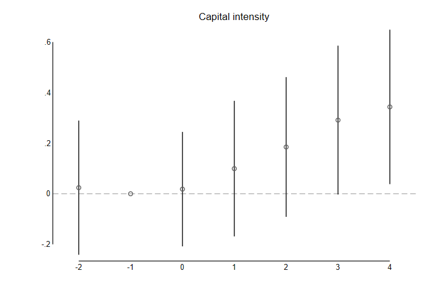
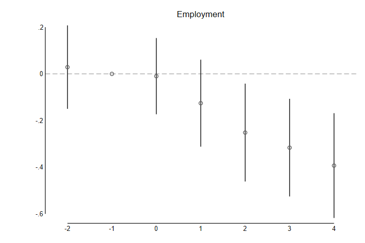
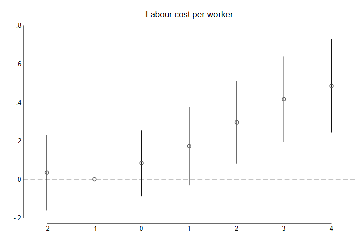
]]
.column.bg-indigo[.content[
Survivor

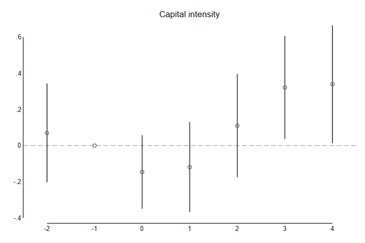
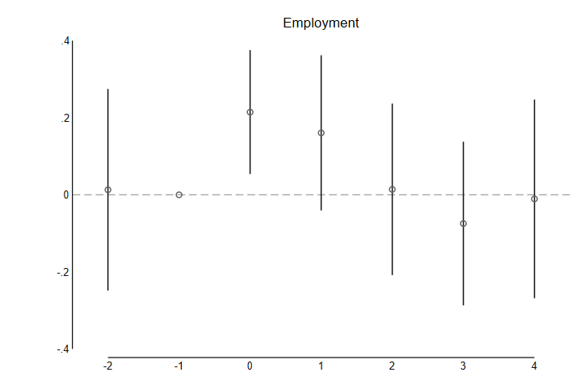
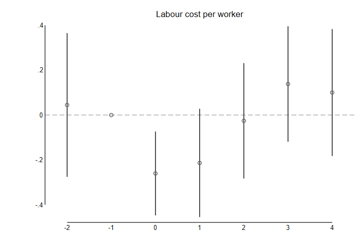
]]
.column.bg-inverse[.content[
Capital intensity went up in 3-4 years.   
* Substituted labor &rarr; capital for both unbalanced and survivor farms.  

Employment (# of employees)  
* Unbalanced: Reduced in 3-4 years.  
* Survivor: Shot up at the impact, settled down in 3-4 years.  

Labour costs per worker   
* Unbalanced: Increased in 3-4 years.  
* Survivor: Reduced at the impact. Initially substituted high paid workers &rarr; low paid workers?   
]]
---
class: split-three, inverse

.column.bg-indigo[.content[
Unbalanced

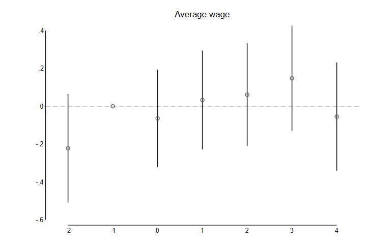
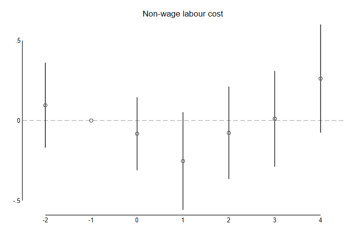
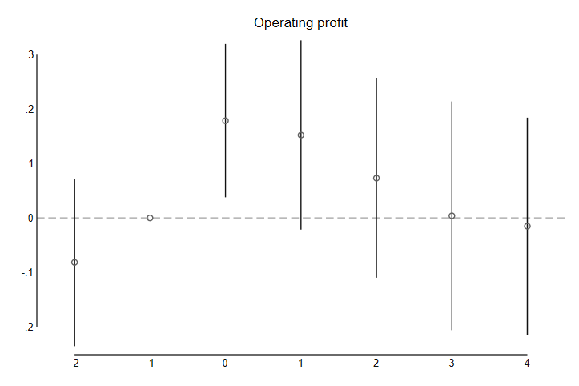
]]
.column.bg-indigo[.content[
Survivor

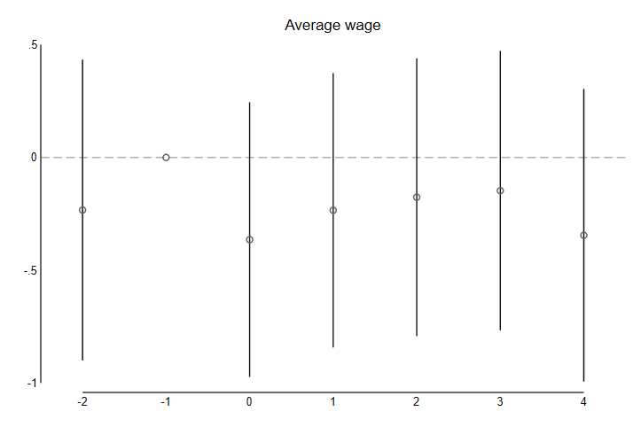
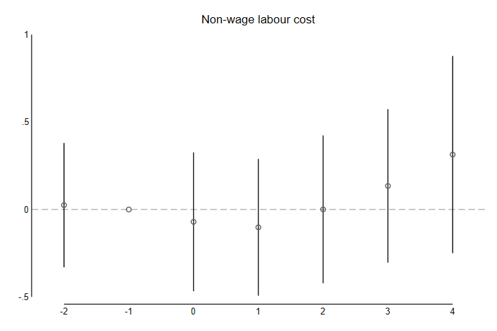
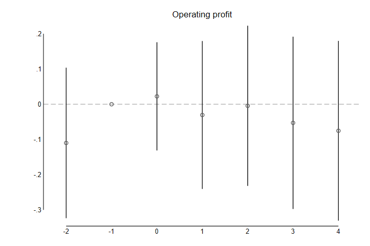
]]
.column.bg-inverse[.content[
Average wage   
* Unbalanced: Unchanged.  
* Survivor: Reduced and stayed down for 4 years (statistically indistinguishable from zero).  

Non-wage labour costs  
* Unchanged for both at the impact.  
* It may go up after 5 years?  

Operating profits  
* Unbalanced: Increased at the impact.  
* Survivor: Unchanged.  

Unbalanced farms   
 * Substituted labour &rarr; captal.  

Survivor farms  
  * Substituted labour &rarr; captal.
  * Substituted high paid workers &rarr; low paid workers.  
]]
---
class: inverse, center, middle

# From Marlies, Jan 24, 2024

---
class: split-three, inverse

.column.bg-indigo[.content[
Unbalanced (CIT)

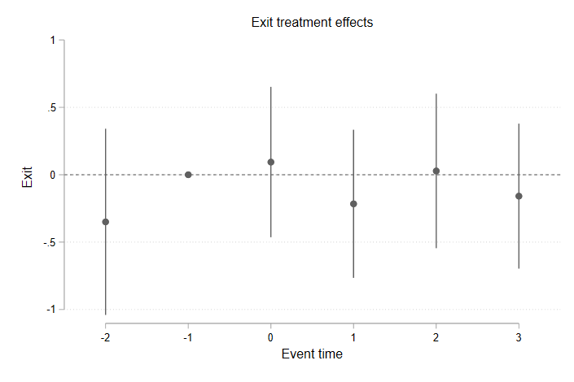
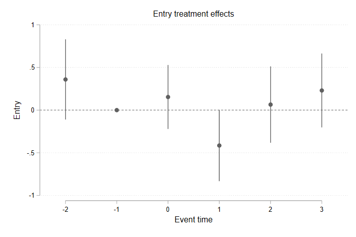
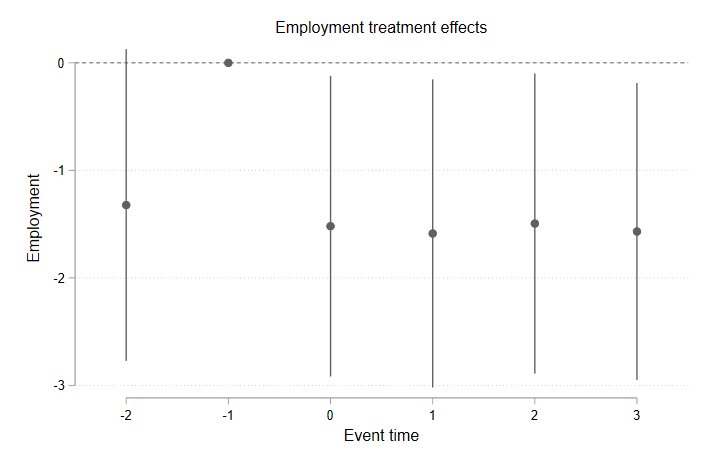
]]
.column.bg-indigo[.content[
Survivor (CIT)

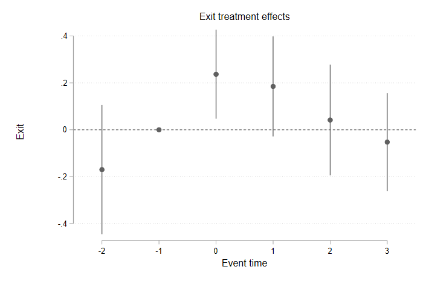

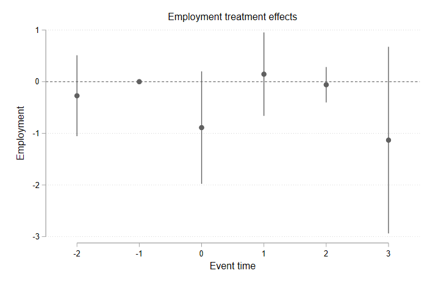
]]
.column.bg-inverse[.content[
&#35; of employees not on payroll (Exit)   
* Unbalanced: Unchanged.  
* Survivor: Increased at the impact.  

&#35; of employees newly hired (Entry)  
* Unbalanced: Unchanged.  
* Survivor: Decreased in 1-4 years.  

Employment (# of employees)  
* Unbalanced: Decreased (large SEs).  
* Survivor: Unchanged.  

Survivor farms reduced new hire, increased termination, but not enough to change employment level.  

]]
---
class: split-three, inverse

.column.bg-indigo[.content[
Unbalanced (non-CIT)

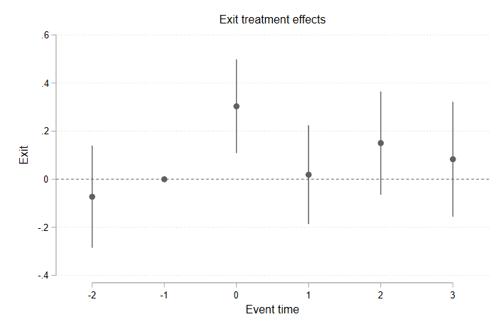
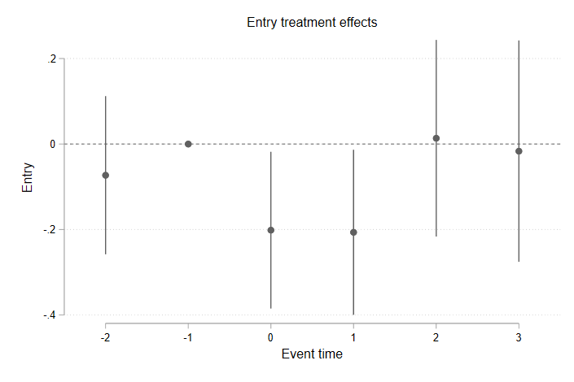
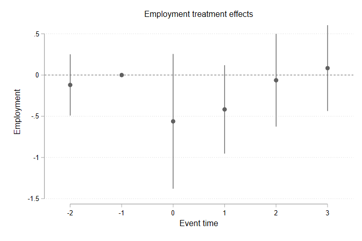
]]
.column.bg-indigo[.content[
Survivor (non-CIT)

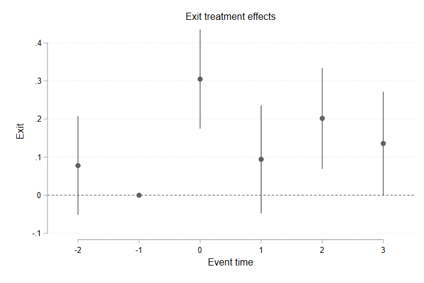
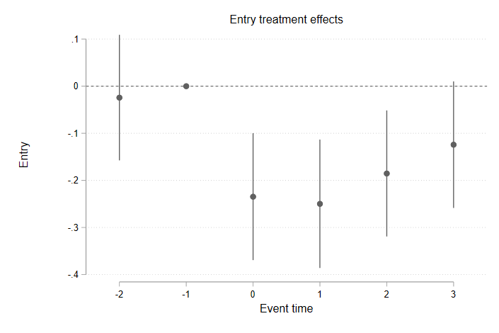
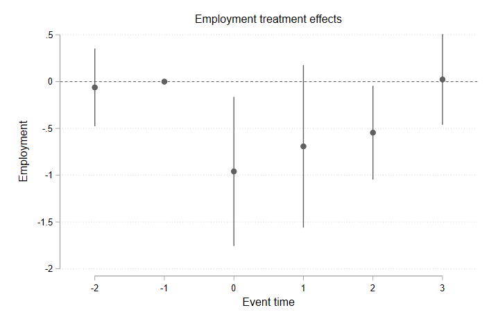
]]
.column.bg-inverse[.content[
&#35; of employees not on payroll (Exit)   
* Unbalanced: Increased at the impact.  
* Survivor: Increased at the impact.  

&#35; of employees newly hired (Entry)  
* Unbalanced: Decreased at the impact.  
* Survivor: Decreased in 1-4 years.  

Employment (# of employees)  
* Unbalanced: Decreased at the impact (statistically zero).  
* Survivor: Decreased in 1-3 years.  

Impacts are more pronounced with non-CIT samples. Implausibly large in some outcomes (small sample bias?)  
]]
---
class: inverse,  middle

## Makes an economic sense that capital intensity increased. 

## Employment is unchanged after 3 years, but it is relative to the control trend. Need to plot the control employment as a reference.  
<!--Why did not survivor farms change employment after 3-4 years?  -->

Economic rationale:  
* If wage costs increased, how does a producer maintain employment, while increasing capital intensity?

---
class: inverse,  middle

## Why did survivor farms initially substitute high wage workers with low wage workers?  

Technological feasibility:  
* If low wage workers = seasonal workers, how can their tasks be substituted?  

Economic rationale:  
* If low wage workers are more affected by minimum wage increase, why does a producer want to use more of a factor whose price became more expensive?

---
class: inverse, center, middle

# From Marlies, Jan 29, 2024

---
class: split-three, inverse

.column.bg-indigo[.content[
Non-survivor (CIT), seasonal

<div style="width: 270px; height: 195px; border: 1px solid black;"></div>
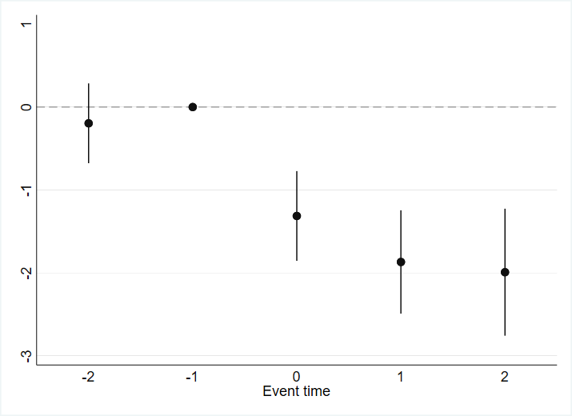
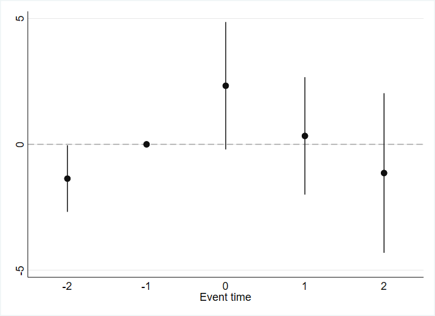
]]
.column.bg-indigo[.content[
Survivor (CIT), seasonal

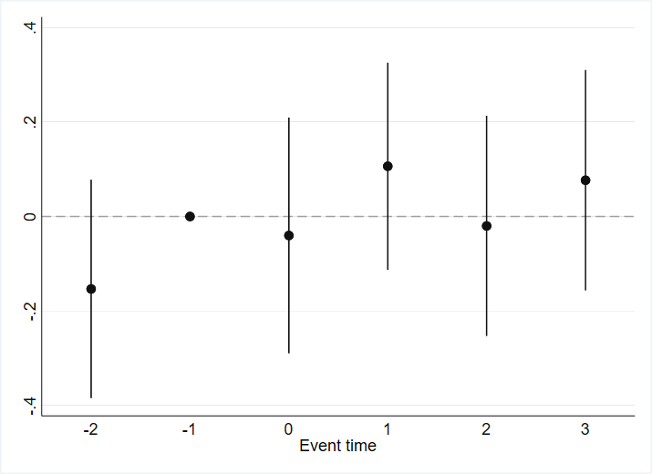
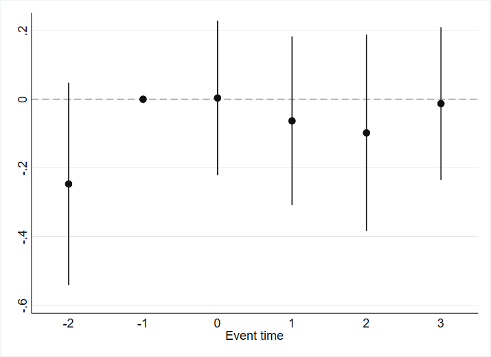
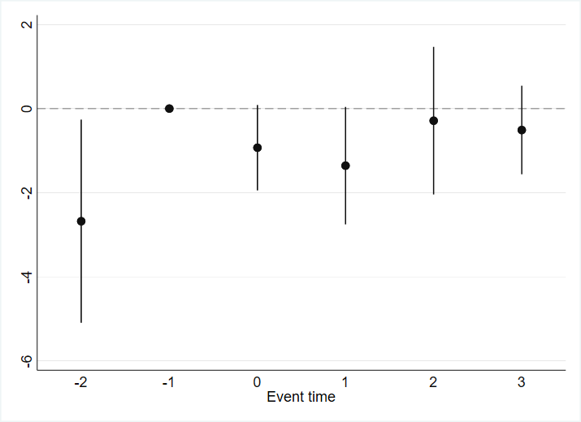
]]
.column.bg-inverse[.content[
&#35; of seasonal employees not on payroll (Exit)   
* Non-survivor: <Results missing>  
* Survivor: Unchanged.  

&#35; of seasonal employees newly hired (Entry)  
* Non-survivor: Decreased in 0-2 years.  
* Survivor: Unchanged.  

Employment (# of seasonal employees)  
* Non-survivor: Increased at the impact (large SE).  
* Survivor: Unchanged, but a dip at $t=-1$.  

CIT seasonal  
* Non-survivor: Reduced new hires.  
* Survivor: Unchanged.  
]]
---
class: split-three, inverse

.column.bg-indigo[.content[
Non-survivor (CIT), non-seasonal

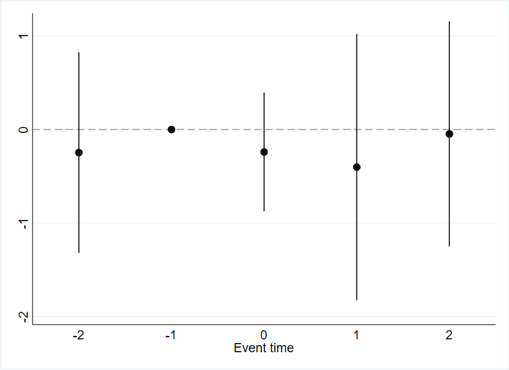
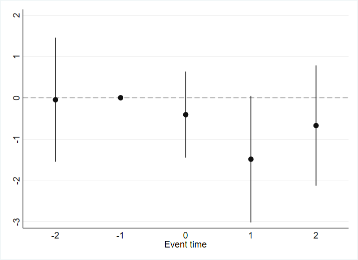
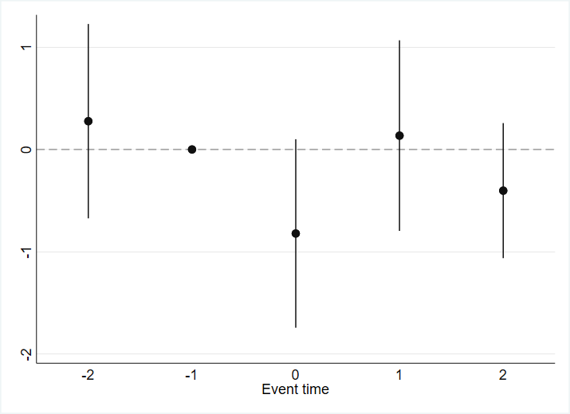
]]
.column.bg-indigo[.content[
Survivor (CIT), non-seasonal

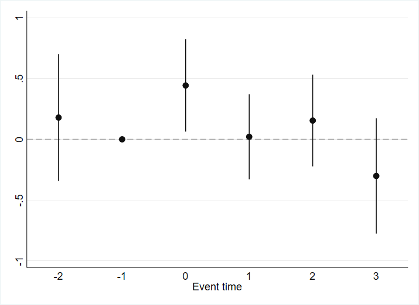
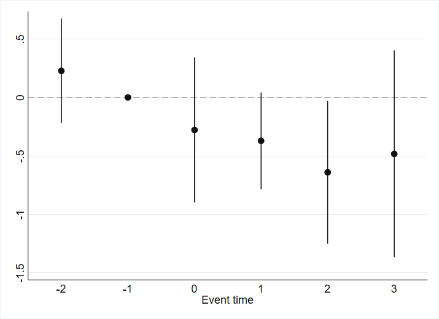
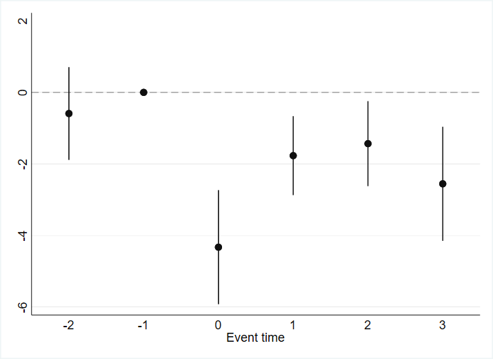
]]
.column.bg-inverse[.content[
&#35; of non-seasonal employees not on payroll (Exit)   
* Non-survivor: Unchanged.  
* Survivor: Increased at the impact but settled down.  

&#35; of seasonal employees newly hired (Entry)  
* Non-survivor: Decreased after 1 year, negative point estimates. 
* Survivor: Unchanged but negative point estimates.  

Employment (# of non-seasonal employees)  
* Non-survivor: Unchanged.  
* Survivor: Decreased.  

CIT non-seasonal  
* Non-survivor: Reduced new hires.  
* Survivor: Reduced new hires and employment.  
]]
---
class: split-three, inverse

.column.bg-indigo[.content[
Non-survivor (Non-CIT), seasonal

<div style="width: 270px; height: 195px; border: 1px solid black;"></div>


]]
.column.bg-indigo[.content[
Survivor (Non-CIT), seasonal

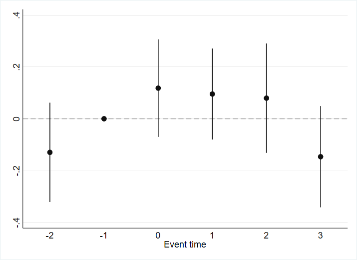
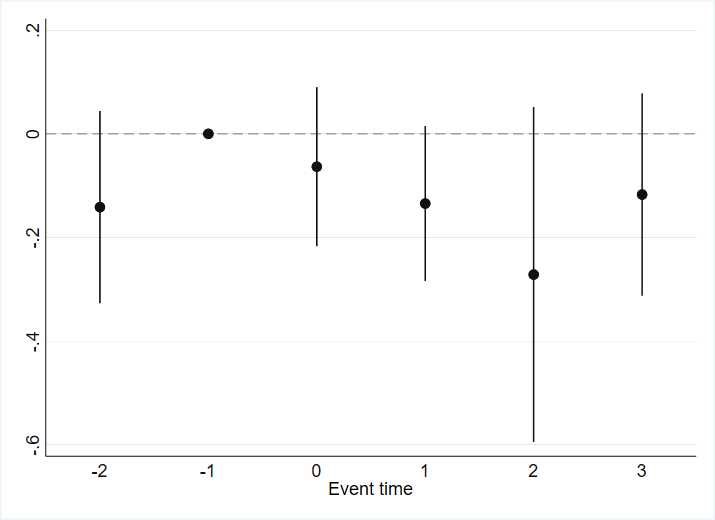
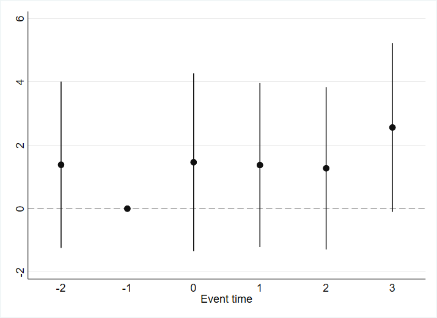
]]
.column.bg-inverse[.content[
&#35; of seasonal employees not on payroll (Exit)   
* Non-survivor: <Results missing>  
* Survivor: Unchanged.  

&#35; of seasonal employees newly hired (Entry)  
* Non-survivor:   
* Survivor: Unchanged.  

Employment (# of seasonal employees)  
* Non-survivor:   
* Survivor: Unchanged, but a dip at $t=-1$.  

Non-CIT seasonal  
* Non-survivor:   
* Survivor: Unchanged.  
]]
---
class: split-three, inverse

.column.bg-indigo[.content[
Non-survivor (Non-CIT), non-seasonal

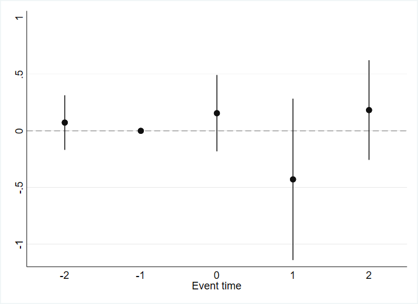
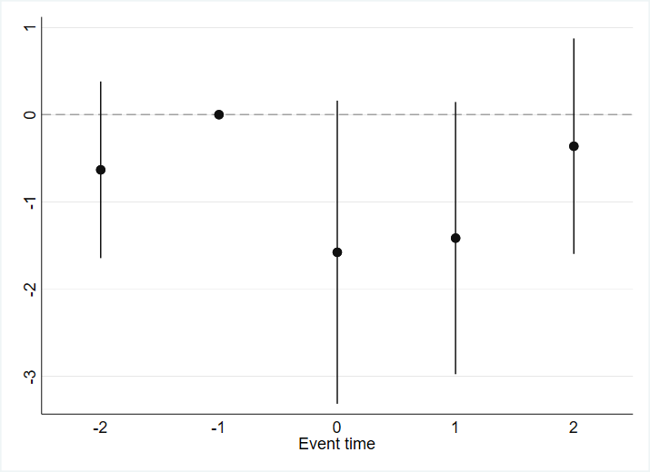

]]
.column.bg-indigo[.content[
Survivor (Non-CIT), non-seasonal

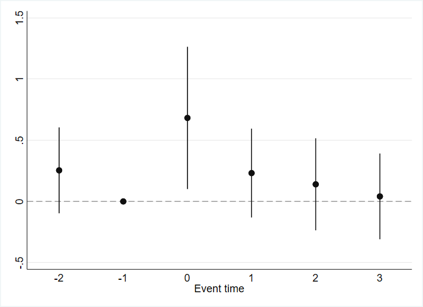
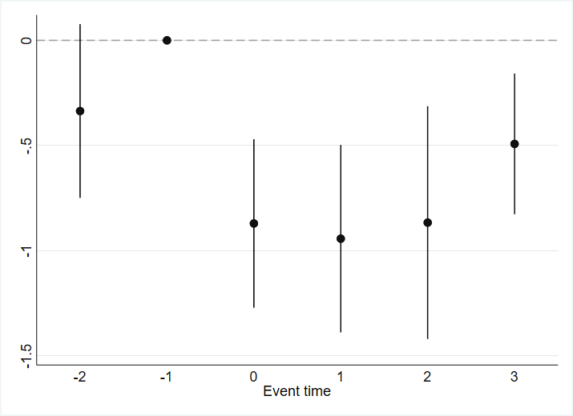
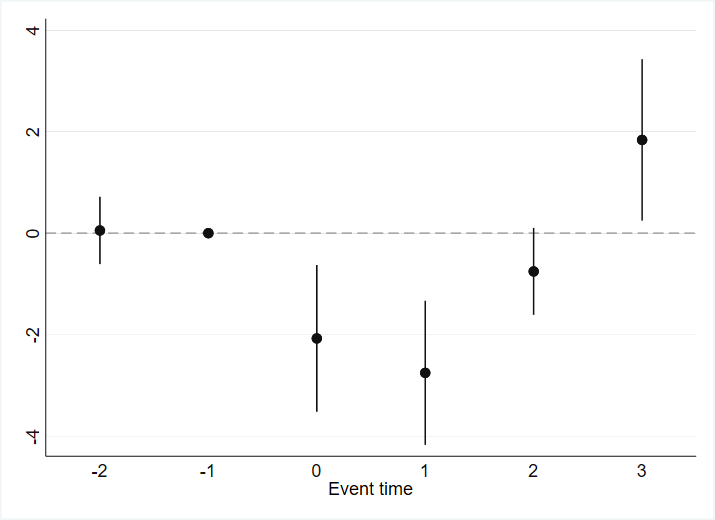
]]
.column.bg-inverse[.content[
&#35; of non-seasonal employees not on payroll (Exit)   
* Non-survivor: Unchanged.  
* Survivor: Increased at the impact but settled down.  

&#35; of seasonal employees newly hired (Entry)  
* Non-survivor: Negative point estimates.  
* Survivor: Decreased.  

Employment (# of non-seasonal employees)  
* Non-survivor: Decreased at 0.  
* Survivor: Decreased for 0-2 years.  

Non-CIT non-seasonal  
* Non-survivor: Reduced new hires and employment at the impact.  
* Survivor: Increased exits, reduced new hires, reduced employmemt.  
]]
---
class: inverse, center, middle

# How should we summarise?

---
class: inverse

## Large farms held seasonal employment, reduced non-seasonal new hires and employment (except non-survivors held non-seasonal employment unchanged). 

* Corporate (CIT) farms reduced non-seasonal new hires and employment, but held seasonal employment at level (except non-survivors reduced new hires).  
* Marginal (Non-CIT) farms reduced non-seasonal employment.  

--

## Large and small farms: Seasonal workers are hard to reduce. Non-seasonal workers were reduced in some cases. Substituted high skilled with low sklled workers?  

---
class: inverse

## Headline: Capital intensity&uarr;  

--

## Possible headline: Stable seasonal employment but reduced non-seasonal employment?  

--

## Possible mechanism: High skilled workers are substituted by machines?  

---
class: inverse, center, middle

# Other things to consider

---
class: inverse

## Regardless of using which/both of unbalanced vs. survivor (complete) panel, need to consider how attrition affect results.  

--

### Are the treated more likely to attrit than the control? 

--

### If so, impacts may be more adverse than estimated.  

--


### To know about it, regress

$$
attrit=a\times characteristics + b\times characteristics*treated + e. 
$$
### and test $b=0$.  
