class: inverse, center, middle
```{r xaringan setup, include=FALSE, warning=FALSE}
xaringanExtra::use_panelset()
library(xaringanthemer)
#style_mono_dark(base_color = "#cbf7ed")
#style_mono_light(base_color = "#23395b")
style_solarized_light(
  text_color = "black", 
  title_slide_background_color = "darkblue",
  link_color = "#009933")
# xaringancolor setup
library(xaringancolor)
xaringancolor::setup_colors(
  red ="red",
  orange ="orange",
  green = "#009933",
  blue = "blue"
)
```
```{r, load_refs, eval = T, include=FALSE, cache=FALSE}
library(RefManageR)
BibOptions(check.entries = FALSE,
           bib.style = "authoryear",
           cite.style = "authoryear",
           style = "markdown",
           hyperlink = "to.doc",
           dashed = T)
## (old) Uncomment below for the 1st run of each R session. 2nd run will get cached results.
## (new) Delete cache if you add an entry to seiro.bib.
myBib <- ReadBib("c:/seiro/settings/TeX/seiro.bib")
```
```{css, echo = F}
.pull-left60 {
  float: left;
  width: 57%;
  padding-right: 2px
  margin-top: -1em;
  margin-bottom: 0em;
}
.pull-right40 {
  float: right;
  width: 37%;
  padding-left: 2px
  margin-top: -1em;
  margin-bottom: 0em;
}
.pull-left70 {
  float: left;
  width: 67%;
  padding-right: 2px
  margin-top: -1em;
  margin-bottom: 0em;
}
.pull-right30 {
  float: right;
  width: 27%;
  padding-left: 2px
  margin-top: -1em;
  margin-bottom: 0em;
}
.pull-left50 {
  float: left;
  width: 50%;
  padding-right: 0px;
  padding-left: 0px;
  margin-top: -2em;
  margin-bottom: -1em;
}
.pull-right50 {
  float: right;
  width: 50%;
  padding-right: 0px;
  padding-left: 0px;
  margin-top: -2em;
  margin-bottom: -1em;
}
.center2 {
  margin: 0;
  position: absolute;
  top: 50%;
  left: 50%;
  -ms-transform: translate(-50%, -50%);
  transform: translate(-50%, -50%);
}
```
```{r xaringan-panelset, echo=FALSE}
library(xaringanExtra)
use_panelset()
```
<script type="text/x-mathjax-config">
MathJax.Hub.Config({
  TeX: {
    Macros: {
      E: "{\\Large\\varepsilon}",
      bfx: "{\\mathbf{x}}",
      bfX: "{\\mathbf{X}}",
      bfalpha: "{\\boldsymbol{\\alpha}}",
      bfbeta: "{\\boldsymbol{\\beta}}",
      bfgamma: "{\\boldsymbol{\\gamma}}",
      st: "{\\mbox{s.t.}}"
    }
  }
});
</script>

# Agricultural producer responses to minimum wage changes
## The case of South Africa
<br>
### Kilumelume, von Fintel, Piek, Ito

<br>
### IDE DP presentation
### March 21, 2024

---
class: inverse, center, middle
name: IntroCover
# Motivation
---
class: inverse
name: Intro1

## Why minimum wages

--

## Policy interests: Objective = poverty alleviation

--

## Academic interests: [Reduce employment?](#NeumarkShirley)

--

## An emerging concensus: Does not necessarily reduce employment. 

--

* A survey of research economists `r Citep(myBib, "Geide2020")`  

--

* David Card received the Nobel Prize `r Citep(myBib, "CardKrueger1994")`  

--
<br>

## If not reduce employment, it should reduce poverty

---
class: inverse
name: Intro2

## Why will not minimum wages reduce employment?

--

## Oligopsony

--

* Labor costs&darr; : Decrease quits, increase job searchers (...job search models)  

--

* Wage floor&uarr; discretely: Marginal costs of labour = 0 (for a while, [static monopsony models](#MCIsAboveSCurve) )  

--

* `r Citet(myBib, "Robinson1933")`; `r Citet(myBib, "BhaskarManningTo2002")`  

--

## Competitive labour markets: MW&uarr; &rarr; employment&darr;

--
<br>
## So which one is it?

--
<br>
## Differs by market. Let's see what the data show.
---
class: inverse, center, middle
name: WeShowCover
# We show employment reduced among low wage workers, the policy target.

<br><br>

# We show capital intensity increased.

---
class: inverse, center, middle
name: IntroCover
# What we know by far
---
class: inverse

## Agricultural MW .red[may have reduced employment] in South Africa

* 2003 MW introduction: Descriptive arguments of disemployment despite "increased" in estimated results `r Citep(myBib, "BhoratKanburStanwix2014", after = ", contrasted with similar industries")`, disemployment of certain crops `r Citep(myBib, "MurrayVanWalbeek2007", after = ", sugar cane in KZN coasts")`  
* 2005 MW increase: Disemployment prediction based on wage elasticity estimates `r Citep(myBib, "Conradie2005", after = ", wine grapes in WC")`  
* 2007 MW unification: Increased tractor sales `r Citep(myBib, "ChrisRulofRankin2015")`, firn profit and employment reduction for some crops using district level data `r Citep(myBib, "ItoSeiro2021")`  

--

## .red[No definitive evidence] by far. 

--

<br>
## Potential culprit: Small sample size

* Cannot identify small effects, can only admit large effects  
* Can result in unignorable sampling errors: Accidentally sampled in a biased way  
---
class: center
name: weak
background-image: url("EvidenceWeek3.jpg")
background-size: 100%

<br><br><br><br><br><br>

# Evidence was weak, because data was weak.

<br><br><br><br><br><br><br><br><br>

.right[.red[Photo © James Hopkirk]]
---
class: center
name: weak
background-image: url("EvidenceWeek3.jpg")
background-size: 100%

<br><br><br><br><br><br>

# Garbage in, garbage out.

<br><br><br><br><br><br><br><br><br>

.right[.red[Photo © James Hopkirk]]
---
class: inverse

## Data used in previous studies

--

.pull-left[
### .orange[Labour supply side]  

* Household surveys

Pros  

* Covers informal sector  

Cons  

* Imprecise  
* Small sample size  
* Panel is relatively rare  
]

--

.pull-right[
### .orange[Labour demand side]  

* Tax revenue data  
* Manufacturing census  


Pros  

* More precise  
* Large *sample* size  
* Other adjustment channels  

Cons  

* Only formal sector, overstated impacts  
* Imprecise labour contents  
]

--
<br>

### .blue[Matched employee-employer (MEE) data]

* Corporate Income Tax+ Employee Payrolls = shows how many are earning how much 

--

* Rare in developing countries
--
.red[&larr; our paper]
---
class: inverse

## Suitable research design by data type

.pull-left60[
### .orange[Supply side data can show]

* Impacts of a policy "with unaffected group"  
* Contrasts between formal and informal  
* General information  

### .orange[Demand side data can show]

* Impacts of a policy "with unaffected group"  
* Other adjustment channels (capital, profits, prices, etc.)  
]

--

.pull-right40[
* Findings (from demand side data and supply side data) are complementary.  
* Neither is superior.  
* Estimators: EvSt-DID, RDD, SCM.  
* Can only study a policy of limited coverage.  
]

--
<br>
.pull-left60[
### .blue[MEE data can show]

* What demand side data can show, plus,  
* Impacts without a control group under a dose-response framework.  
* Our paper: Dose=.blue[fraction affected: Fraction of sub-minimum wage workers in a firm] 
]

--

.pull-right40[
* .red[Impacts without a control group] &larr; Pretty big...superior? No, needs common trend assumption as in DID.  
   * Use .blue[common rate] assumption.  
* Same reservations apply as demand side studies  
]
---
class: inverse

## Suitable research design by data type

--

.pull-left70[
### Supply side data: Spillovers to informal sector 
### Demand side data: All adjustment channels (labour, capital, profits, prices)  
### Both: A policy with an unaffected group  
]

--

.pull-right30[
* Findings (from demand side data and supply side data) are complementary.  
* Neither is superior.  
* Can only study a policy of limited coverage.  
* Estimators: EvSt-DID, RDD, SCM.  
]

--

<br><br>
.pull-left70[
### .blue[MEE data can show]

* What demand side data can show, plus,  
* Impacts without a control group under a dose-response framework.  
* Impacts of any policy.  
* Our paper: Dose=.blue[fraction affected: Fraction of sub-minimum wage workers in a firm] 
]

--

.pull-right30[
* .red[Impacts without a control group] &larr; superior? No, needs common trend assumption as in DID.  
   * .blue[Common rate] ass.  
* Same reservations apply as demand side studies  
]
---
class: inverse
name: Data
## Data: South African Revenue Services

### Corporate Income Tax (CIT)

* Formal establishments: Anual net income $>$ R2000 (USD `r round(2000/7.3)`).  
* Revenue, profit, capital, various cost components.  

--

### Employee Income Tax Certificates (IRP5)

* Individuals: Anual income $>$ R2000.  
* Job duration, incomes.  
   * Seasonal workers: Duration less than 6 months  
   * Low wage workers: Monthly income $<$ R5400 (USD `r round(5400/7.3)`)  
   * .blue[Fraction affected] of each firm  
* Cannot distinguish part time workers. We do not have wage rates or work hours.  

--

## And we merge the two together: CIT-IRP5

* 2011-(2013)-2017  
* Keep only: Exist in both data sets, perrenial crops, non-perennial crops, plant propagation, livestock, mixed farming, existed before 2013: Over 1.5 M &rarr; 1.1 M.  &rarr; 40,697 &rarr; 18,919.  

---
class: inverse, center, middle
name: IdentifcationCover
# Identification strategy
---
class: inverse
## Estimating equation `r Citep(myBib, "HarasztosiLindner2019")` 

\begin{equation*}
\% \mbox{ change in }y_{it} = \alpha_{t}+\beta_{t}FA_{i}+\bfgamma'\bfx_{it}+\epsilon_{it}.
\end{equation*}

$\beta_{t}$ measures impacts of sub-MW worker % on % change of $y_{it}$ (base: 2012).

--

<br>
## Crucial assumption = .red[*Common rate*]: % change in *y* is common for all value of *FA* 

--

<br>
## We can observe/test if it holds for pre-policy periods

* But we cannot screen results based on pre-policy trends: A pre-test bias `r Citep(myBib, c("Roth2021", "RambachanRoth2023"))`

---
class: inverse
name: ThingsToWorry
## Things to worry about in our data

--

### Informal sector: No enforcement, limited data

* Ignores spillovers to/from informal sector if only estimated with formal sector data  
* Can result in .orange[amplified] impact estimates `r Citep(myBib, "Boerietal2011")`  
* .red[Interpretation]: A job lost in formal sector, gained in informal = still a welfare loss  

--

### Limited compliance

* Low rate: Estimated as 44% are paid less than MW in 2007 `r Citep(myBib, "Bhorat2012")`   
* Results in .orange[underestimation] of impacts  
* .red[Interpretation]: Disemployment could have been worse (despite labour oligopsony can sustain $L$ to an extent)  
* We can [observe it in data](#Compliance) (with a reservation: parttimers are included)  

--

### No wage rates, work hours: Part timers are included in *FA*

* $FA$ may be overstated, so exposure could have been smaller, leading to .orange[underestimation].  

--

### Attrition

* If higher $FA$ firms attrit more, leading to .orange[underestimation] of impacts.  

---
class: inverse, center, middle
name: BackgroundCover
# Background
---
class: inverse

## MW was introduced in agriculture in 2003.  

--
<br>
## MWs were anually adjusted for inflation. But a major strike broke out in 2012.  

--
<br>
## March 1, 2013: 50% increase (R70&rarr;R105 per day) in agri MW.

--
<br>
## Almost no study on 2013 MW hike. No control group.  

--

* `r Citet(myBib, "PiekFintelKirsten2023")`: Non-seasonal employment growth decreased through slower rates of entry.  

---
class: inverse, center, middle
name: ResultsCover
# Results
---
class: inverse
background-image: url("FromMichael2024Feb13/Sample_r5400/GeneralResults/unbalanced/Employment-cluster_weight.png")
background-size: 80%
# .blue[Full sample]
---
class: inverse
.pull-left[
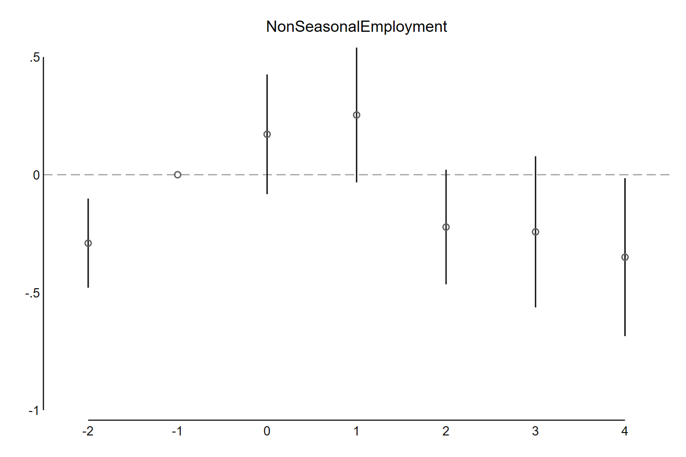
]
.pull-right[
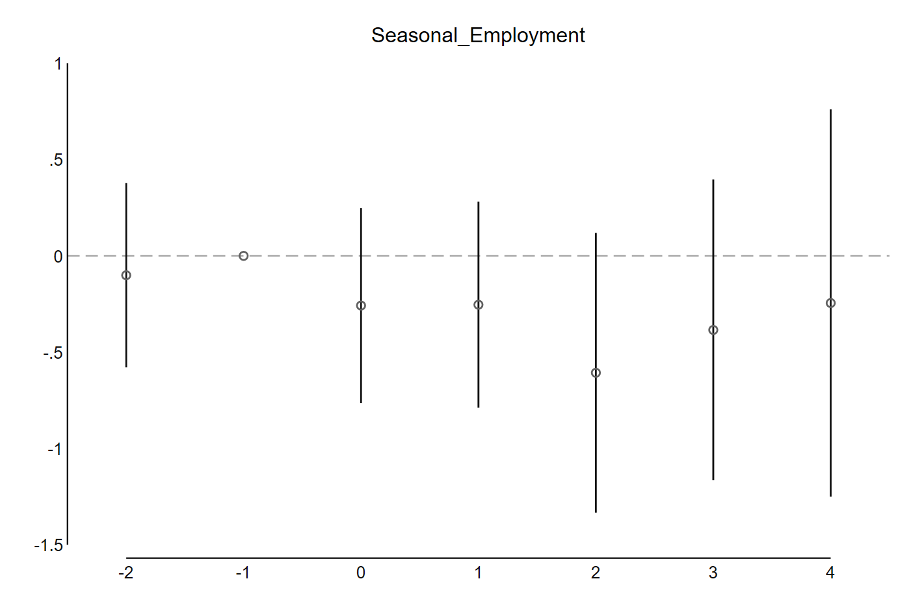
]

## Growth reduced for non-seasonal employment. Seasonal employment is hard to slash. 

---
class: inverse
.pull-left50[
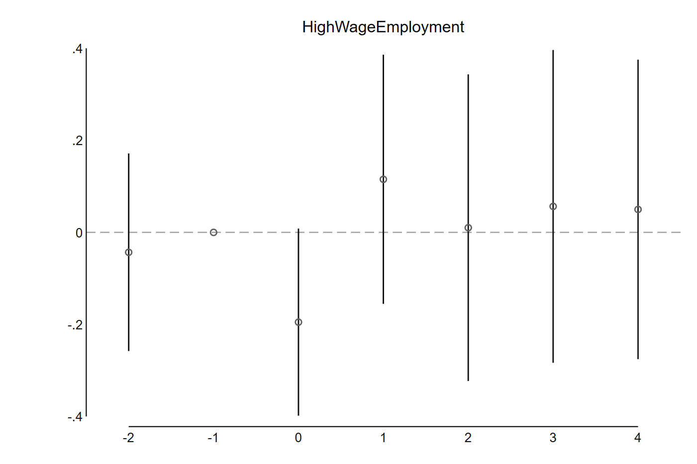
]
.pull-right50[
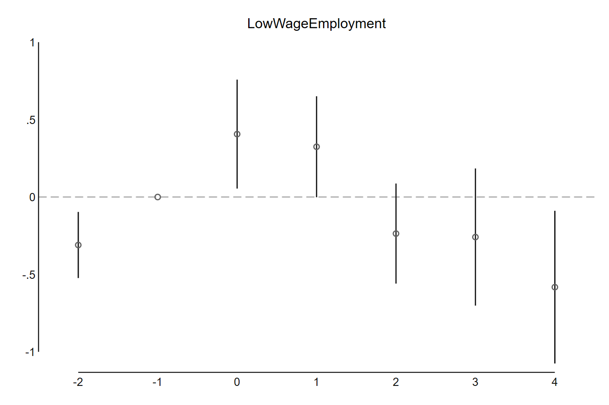
]

## At impact: Growth reduced for high wage employment. Substituted with low wage employment. 
<br>	
## In 4 years: Growth reduced for low wage employment. 
---
class: inverse
.pull-left[
Full sample  

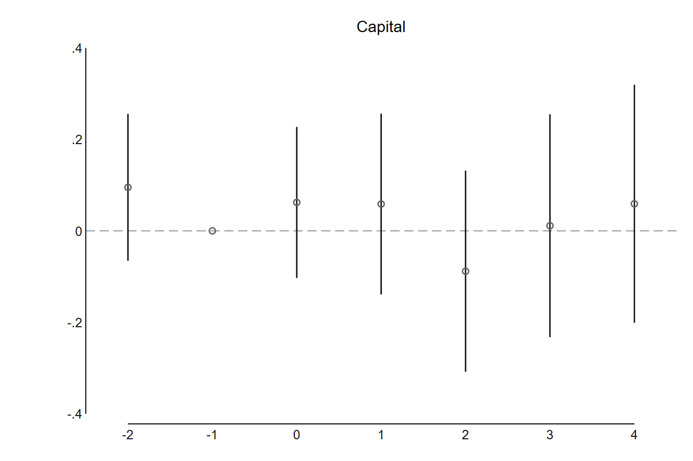
]
.pull-right[
Balanced panel  

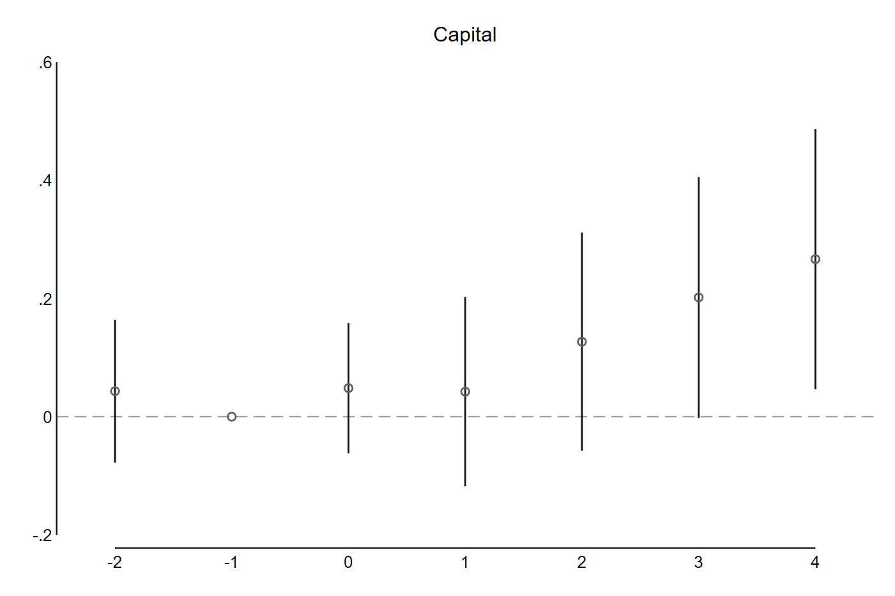
]

## Increased capital growth among surviving firms which are less credit constrained.  
---
class: inverse
.pull-left[
Full sample  

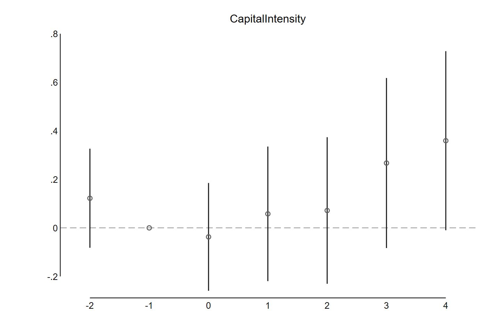
]
.pull-right[
Balanced panel  

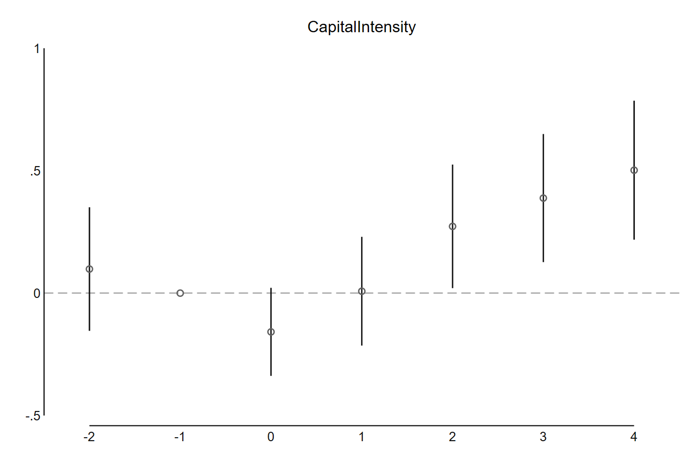
]

## Growth increased for capital intensity. More for surviving firms which are less credit constrained.  
---
class: inverse
.pull-left[
Balanced panel  

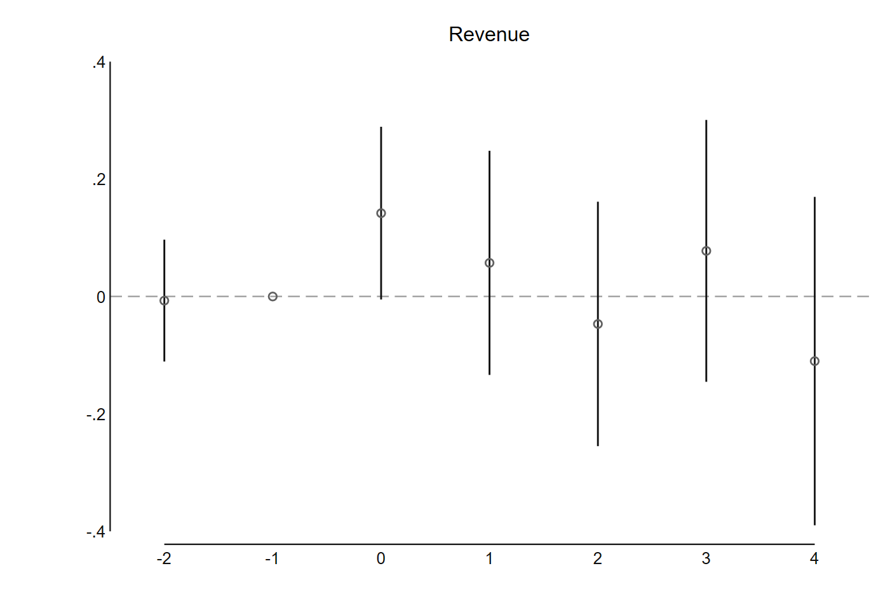
]
.pull-right[
Balanced panel  

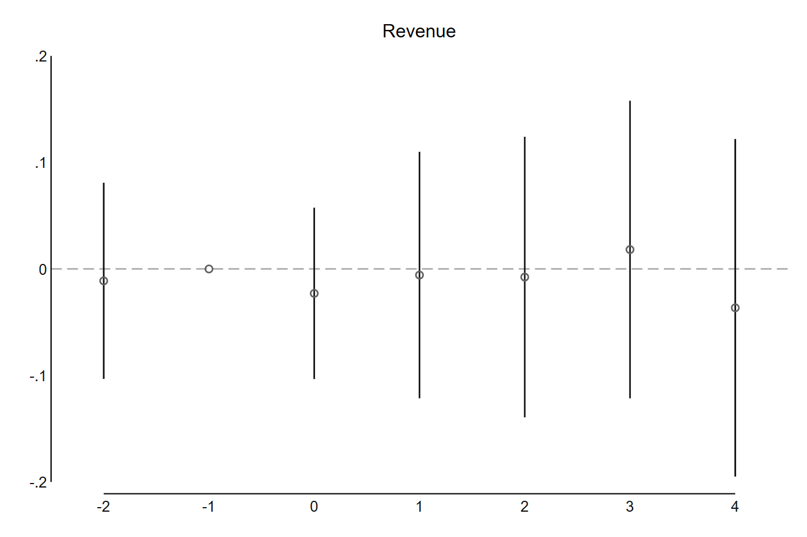
]

## No change in revenue growth.  
---
class: inverse
.pull-left[
Full sample  

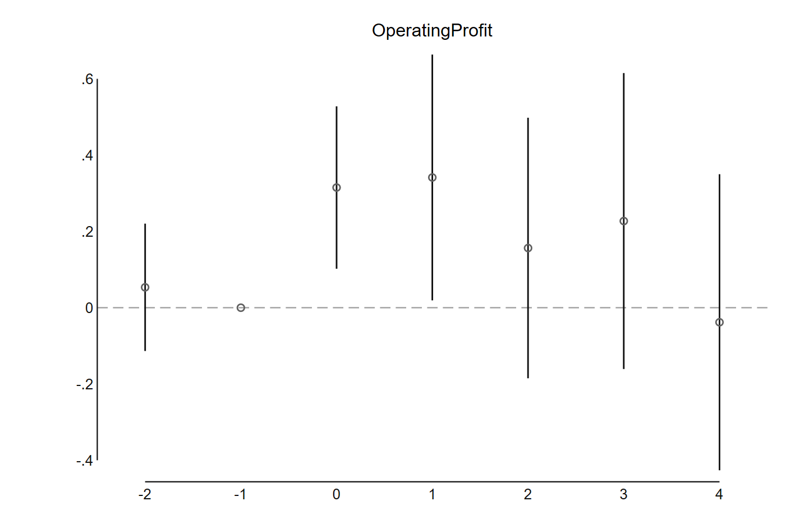
]
.pull-right[
Balanced panel  

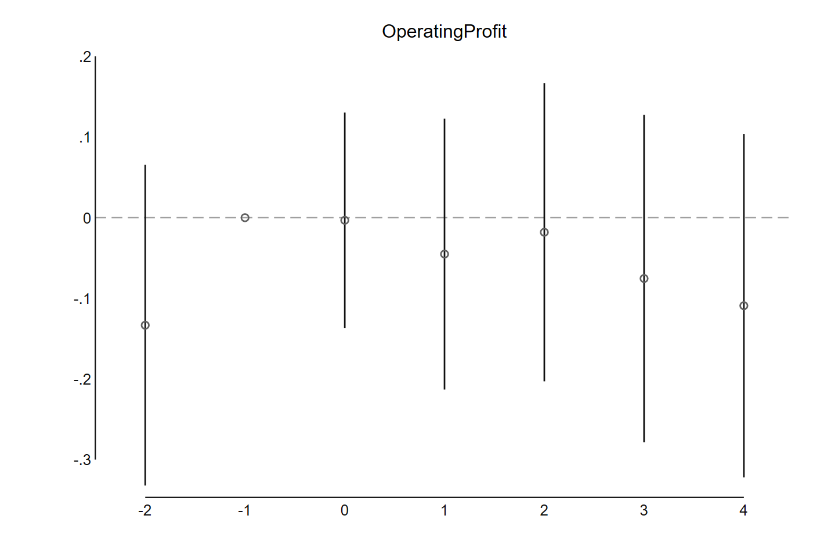
]

## No change in operating profit growth.  
---
class: inverse

## Headline: Capital intensity growth&uarr;  

--

<br>
## Headline: Nonseasonal/low wage labor growth&darr;  

--

<br>
## Surviving firms substituted labour with capital. 

<br>
## Firms held seasonal employment, reduced non-seasonal/low wage employment (new hires&darr;). 

* Despite possible labour oligopsony.  

---

### If higher *FA* firms attrit more, impacts may be more adverse than estimated.  

--

### To know about it, regress

$$
attrit=a\times characteristics + b\times FA + c\times characteristics*FA + e. 
$$
### and test $b=0, c=0$.  
---
class: inverse, center, middle
name: ConlcusionCover
# Conclusion
---
class: inverse

# MW does not necessarily but will reduce employment if it is raised too much.  
--
<br><br>
# MW hike in 2013 reduced the growth in low wage employment. Firms responded with mechanisation. It was an overkill.  
--
<br><br>
# A large hike impact can only be estimated with MEE data.  
---
class: inverse, middle
name: CoauthorsCover
# Coauthors

## .center[Michael Kilumelume &#x1F3CB;]
## .center[Marlies Piek]
## .center[Dieter von Fintel]

# Thanks to

## .center[SA Treasury Department, SARS &#x1F4C8;]
## .center[UNU-WIDER &#x1F4B6;]
## .center[IDE &#x1F4B4;]

---
class: inverse
```{r results = "asis", echo = FALSE, warning = F}
PrintBibliography(myBib, .opts = list(check.entries = FALSE, sorting = "nyt",
  no.print.fields=c("eprint", "URL")),
  start = 1, end = 7)
```
---
class: inverse
```{r results = "asis", echo = FALSE, warning = F}
PrintBibliography(myBib, .opts = list(check.entries = FALSE, sorting = "nyt",
  no.print.fields=c("eprint", "URL")),
  start = 8, end = 14)
```
---
class: inverse
```{r results = "asis", echo = FALSE, warning = F}
PrintBibliography(myBib, .opts = list(check.entries = FALSE, sorting = "nyt",
  no.print.fields=c("eprint", "URL")),
  start = 15, end = 17)
```
---
class: inverse
name: NeumarkShirley
.panelset[
	.panel[.panel-name[Negative]
		.pull-left60[
		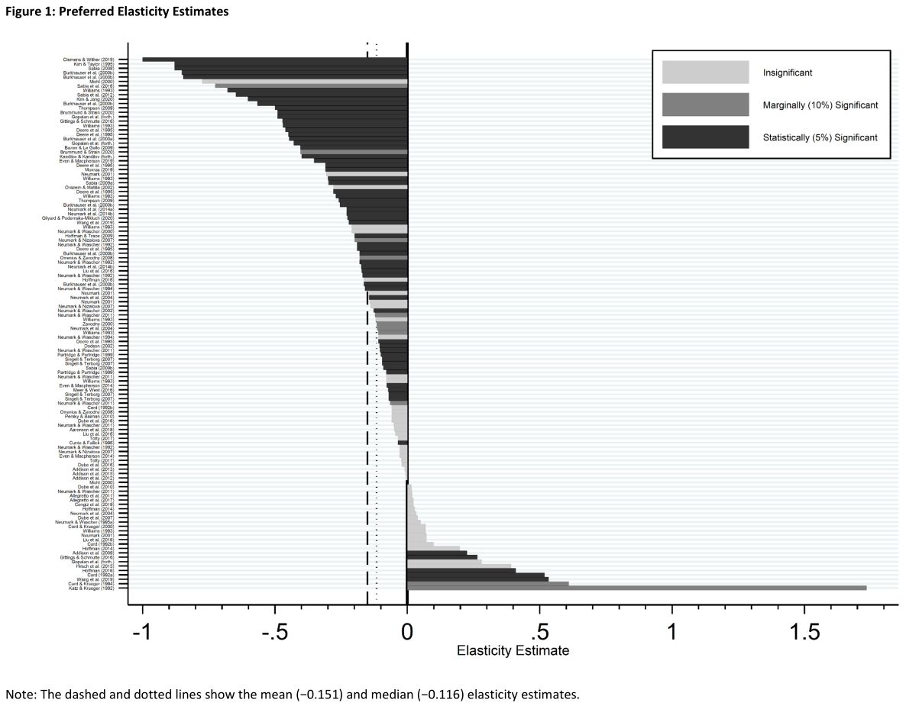
		]
		.pull-right40[
		.left[
`r Citet(myBib, "NeumarkShirley2022")`  

* Majority in negative regions.  
* Small magnitude: Median = -.116  
* "Preferred"  
		]]
	]
	.panel[.panel-name[Nonnegative]
		.pull-left60[
		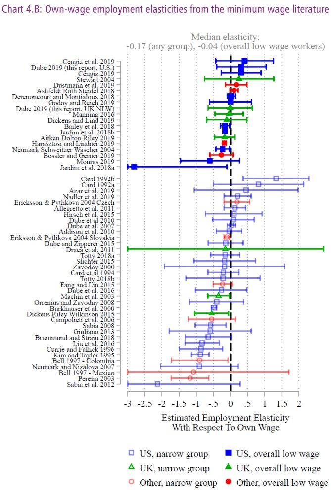
		]
		.pull-right40[
		.left[
`r Citet(myBib, "Dube2019")`  

* All over the place, most CIs cross zero.  
* Small(er) magnitude for overall low wage group: Median = -.04  
* Not a representative sample.  

[back to Contents](#Intro1)
		]]
	]
]
---
class: center, inverse
name: MCIsAboveSCurve
.pull-left60[

]
.pull-right40[
.left[
\begin{aligned}
\frac{\partial w(L_{1})}{\partial L_{1}}&=\overbrace{w(L_{1})+w'(L_{1})L_{1}}^{\mbox{MC}}\\
&>\underbrace{w(L_{1})}_{\mbox{Suppy curve}}
\end{aligned}

]]
---
class: center, inverse
name: MCIsEqualtoSCurve
.pull-left60[
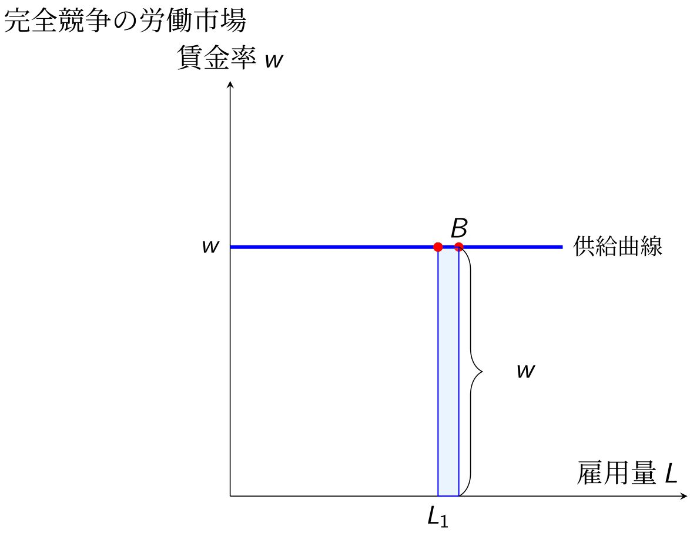
]
.pull-right40[
.left[
$$\frac{\partial w(L_{1})}{\partial L_{1}}=\underbrace{w(L_{1})}_{\mbox{MC}}=\underbrace{w(L_{1})}_{\mbox{Suppy curve}}$$
]]
---
class: center, inverse
name: CompetitiveMarket
.pull-left60[
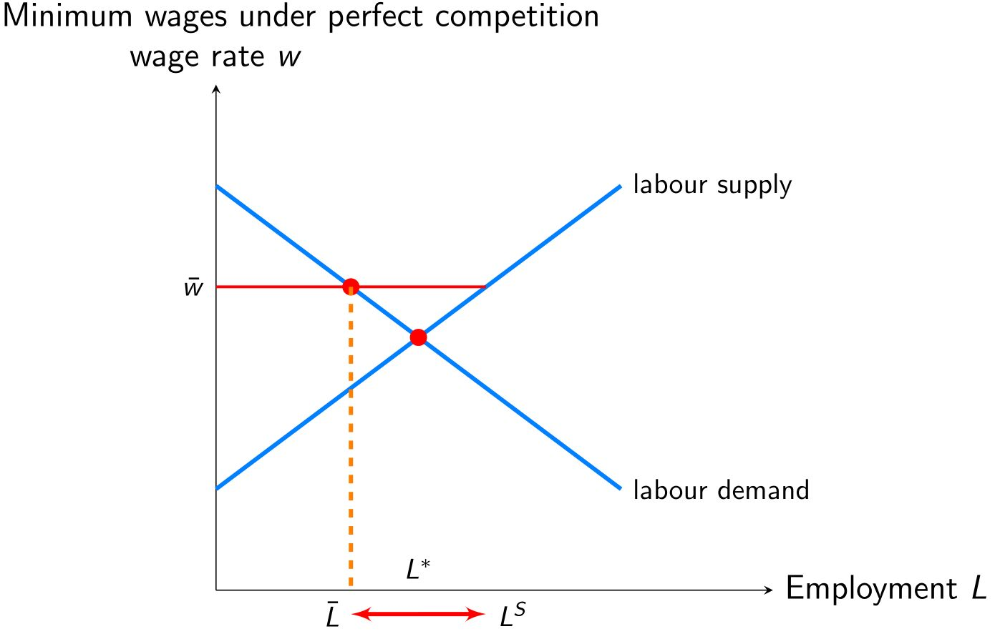
]
.pull-right40[
.left[
* MW set above $w^{*}$ induces unemployment.  
]]
---
class: center, inverse
name: Monopsony1
.pull-left60[
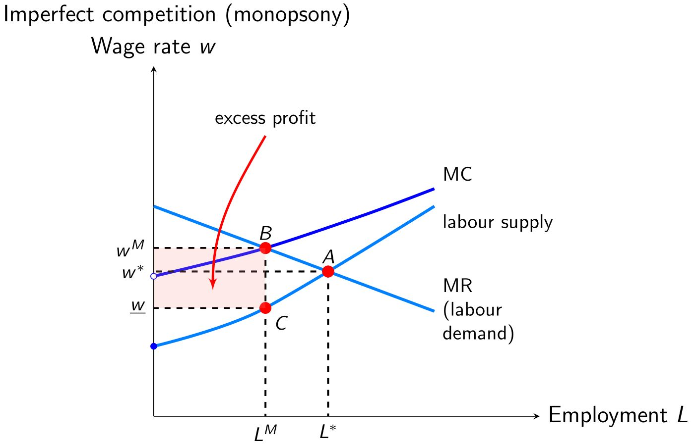
]
.pull-right40[
.left[
* $MC=MR$ &xrArr; $B$, $L^{M}$  
* $L^{M}$ on supply curve &xrArr; $C$, $\underline{w}$  
* Gets excess profit as shaded area, arising from wage markdown $w^{M}-\underline{w}$  
* $A$ is competitive equilibrium  
* No unemployment &xlArr; hired on the supply curve  
* But employment **level** is small  
]]
---
class: center, inverse
name: Monopsony2
.pull-left60[
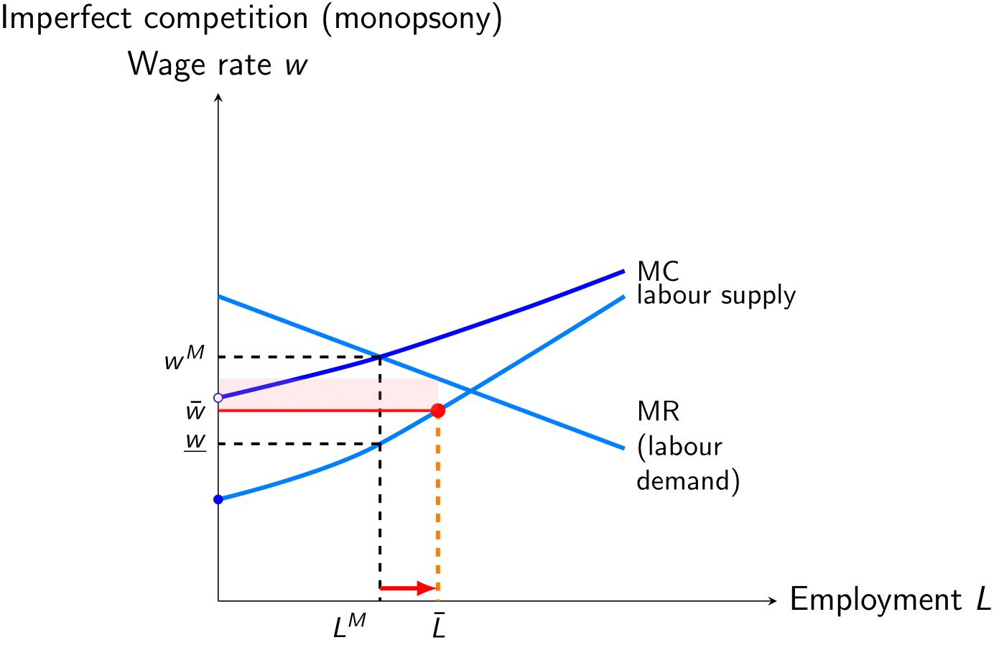
]
.pull-right40[
.left[
* MW set to $\bar{w}<w^{*}$  
* If stay at $B$, excess profit shrinks but remains positive  
   * Just increase wages, absorb with profit decrease  
* If expand to $\bar{L}$, excess profit shrinks but remains positive  
* Flatter the demand curve, larger the latter  
   * If output market is competitive, if MPL does not diminish fast, ...  
]]
---
class: center, inverse
name: Monopsony3
.pull-left60[
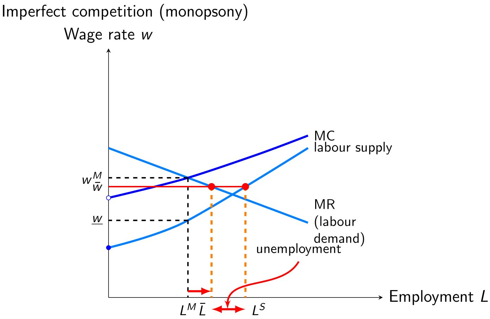
]
.pull-right40[
.left[
* MW set to $\bar{w}>w^{*}$  
* Excess profit disappears  
* Employment still expands to $\bar{L}$  
* But it comes with unemployment  
]]
---
class: center, inverse
name: Monopsony4
.pull-left60[
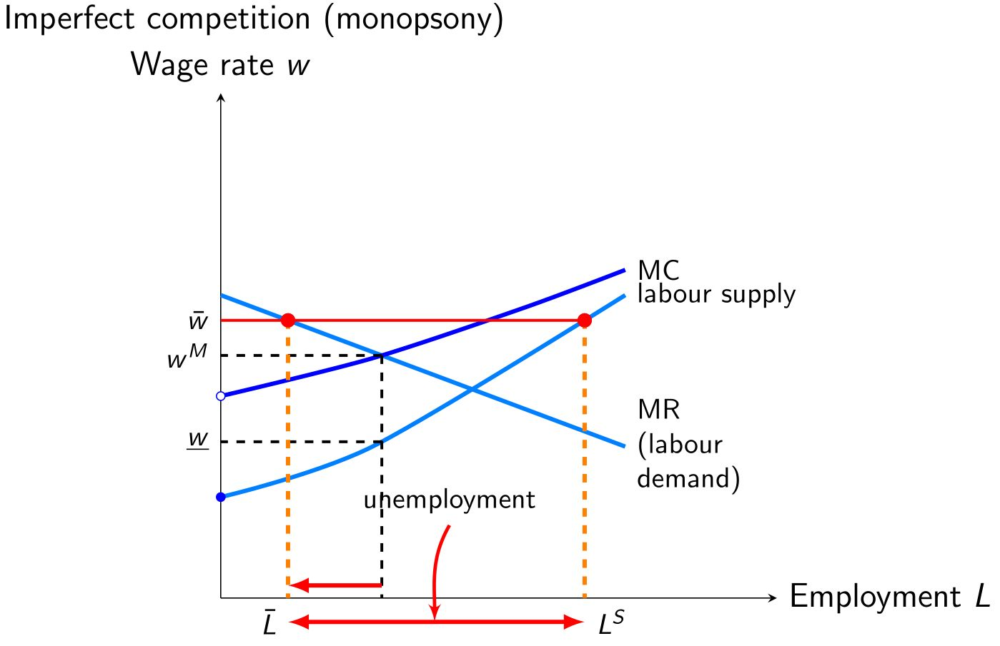
]
.pull-right40[
.left[

* MW set to $\bar{w}\gg w^{*}$  
* Employment shrinks to $\bar{L}$  
* It comes with unemployment  


[back to Contents](#Intro2)
]]

---
class: center, inverse
name: Compliance

.panelset[
	.panel[.panel-name[2012]
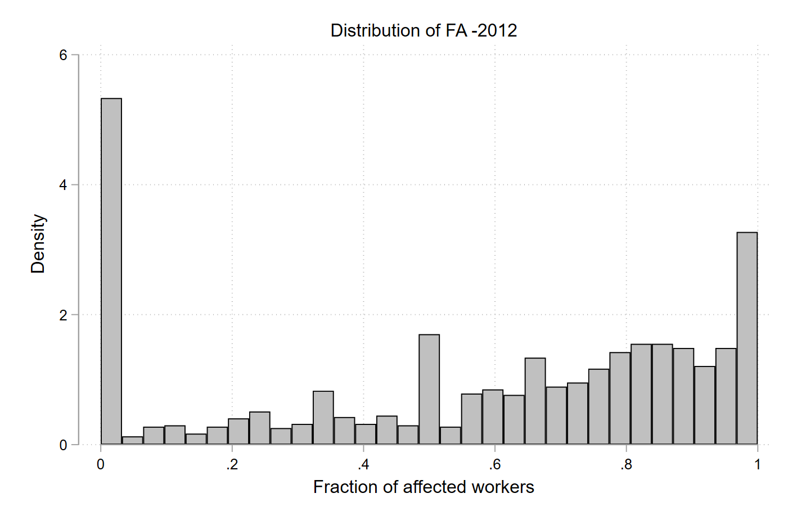
		]
	.panel[.panel-name[2013-2012]
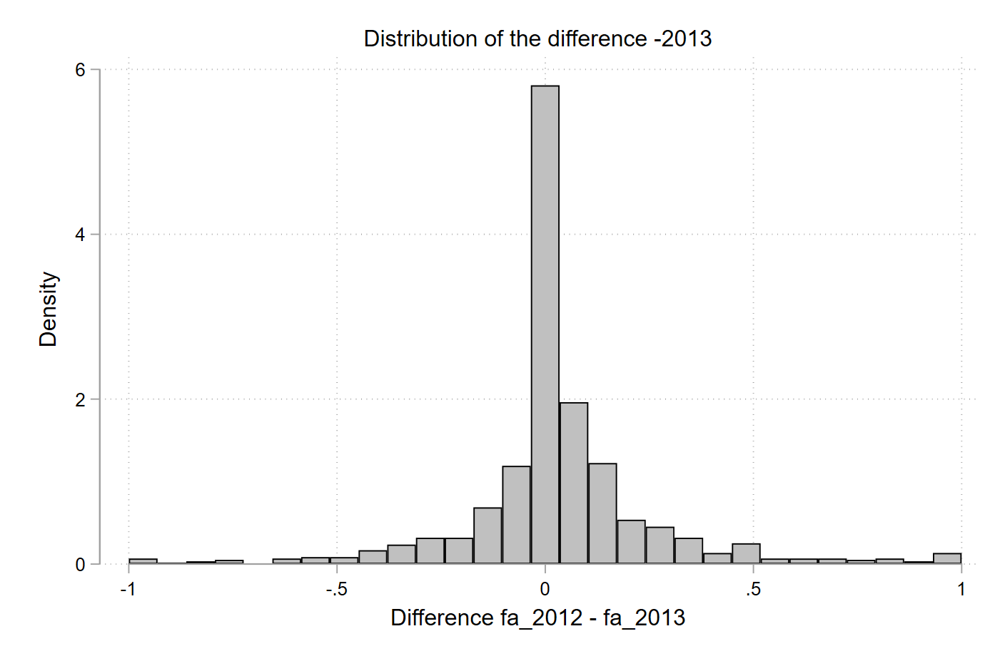
		]
	.panel[.panel-name[2017-2012]
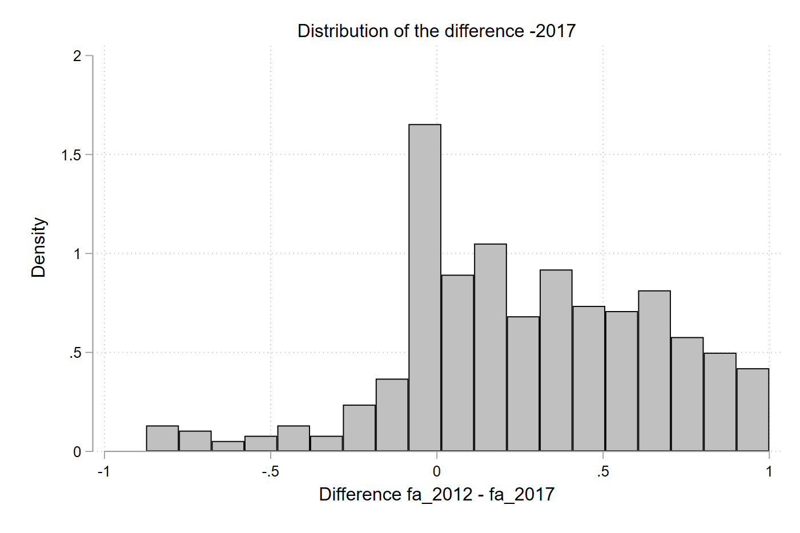
		]
]

[back to Contents](#ThingsToWorry)
